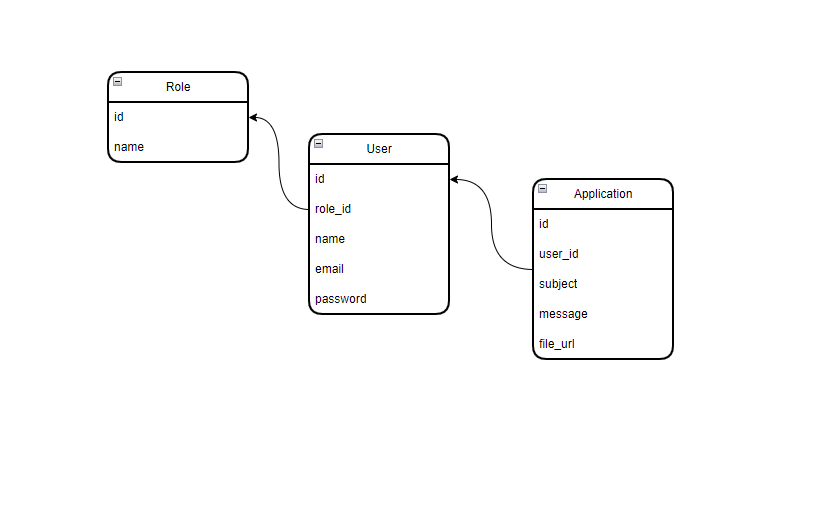

<p align="center">
<a href="https://laravel.com" target="_blank">
</a>
</p>
<p align="center">

</p>

## About Laravel-Task

## Learning

```
composer initial
```

```
npm initial
```

```
php artisan serve
```

```
npm run dev
```

<a href="https://t.me//Sayfillayev_dev">Sayfillayev Muhammad</a>
